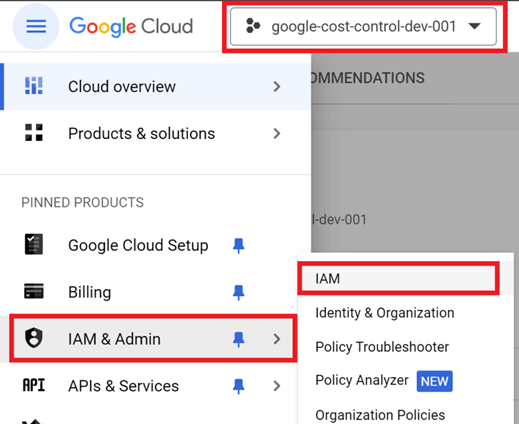
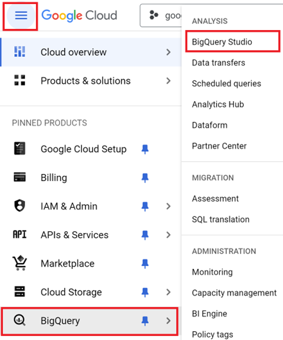

# Crayon Google Cost Control Onboarding Guide
This GitHub repository is dedicated to onboarding customers into Crayon's Google Cost Control platform. It provides detailed instructions for the steps customers need to take to onboard their Google Accounts to Crayon's Google Cost Control successfully. It details how to export Google Cloud billing and recommendation data to BigQuery for better cost management and analysis.

## Table of Contents
1. [Version Information](#version-information)
3. [Prerequisites](#prerequisites)
4. [Steps](#steps)  
   - [Export Cloud Billing Data to BigQuery](#export-cloud-billing-data-to-bigquery)  
   - [Creating Custom Roles](#creating-custom-roles)  
   - [Create a Service Account and Generate a Key](#create-a-service-account-and-generate-a-key)  
   - [Assigning Custom Roles to BigQuery Datasets](#assigning-custom-roles-to-bigquery-datasets)  
   - [Enable the Recommender API](#enable-the-recommender-api)  
   - [Assign Recommender Viewer and Exporter Roles](#assign-recommender-viewer-and-exporter-roles)  
   - [Export Recommendations to BigQuery](#export-recommendations-to-bigquery)  
5. [Final Step](#final-step)  
6. [Release Notes](#release-notes)  
7. [Support](#support) 

## Version Information
- **Version**: 1.0
- **Authors**: [Crayon FinOps Team](mailto:CloudCostControl@crayon.com)
- **Company**: Crayon
- **Last Updated**: 2024-12-13

## Prerequisites
1. An active Google Cloud Billing Account.
2. The **Owner** role for the project is required to enable APIs, create custom roles, datasets, and service accounts, as well as to configure permissions.

## Steps

### Export Cloud Billing Data to BigQuery
If you haven't enabled the Cloud Billing export to BigQuery, [follow this link](https://cloud.google.com/billing/docs/how-to/export-data-bigquery) to configure the export. This setup will automatically export comprehensive Google Cloud billing information, including usage, cost estimates, and pricing data, to a specified BigQuery dataset throughout the day.
### 1. Select a Project
Choose the project where Cloud Billing export to BigQuery has been enabled. Ensure it is selected at the top of the Google Cloud Console. 

   

### 2. Creating Custom Roles
**Two custom roles** are required: one for project-level permissions and another for BigQuery-level access. The project-level role tailors permissions to specific project needs, while the BigQuery-level role ensures precise access controls within the BigQuery environment.

   #### 2.1 Project-Level Role
   1. Navigate to **IAM & Admin > Roles** in the Google Cloud Console.

      

   2. Click **+ CREATE ROLE** to create a new custom role.

      
   3. Enter the following details:
      - **Title**: `Crayon FinOps GCP Project-Level Reader`
      - **ID**: `CrayonFinOpsGCPProjectLevelReader`
      - **Description**: Provide a meaningful description of the role.
      - **Role launch stage**: Set to "General Availability".
      - Click **+ ADD PERMISSIONS** and add the following permissions:

         

      - Use the permissions filter or browse the list to select permissions to add to the role.
         - `bigquery.readsessions.create`
         - `bigquery.readsessions.getData`
         - `bigquery.readsessions.update`
         - `resourcemanager.projects.get`
         - `bigquery.jobs.create`

            

         Continue selecting permissions. After selecting all five (5) permissions, click **"ADD"**.
      - Click **"SHOW ADDED AND REMOVED PERMISSIONS"** (in red) to review and confirm the added permissions.

         
         
         

      - Click **Create** to finalize the role creation.

#### 2.2 BigQuery-Level Role
The BigQuery-level role ensures precise access controls for the BigQuery environment.

   1. Repeat steps **2.1** (same steps as for the project-level role) to create a new role for BigQuery Level and use the following details:
      - **Title**: `Crayon FinOps GCP Cost-and-Usage Reader`
      - **ID**: `CrayonFinOpsGCPCostUsageReader`
      - **Description**: Provide a meaningful description of the role.
      - **Role launch stage**: Set to "General Availability".

   2. Add the following permissions:
      - `bigquery.datasets.get` 
      - `bigquery.models.export`  
      - `bigquery.models.getData`  
      - `bigquery.models.getMetadata`  
      - `bigquery.models.list`  
      - `bigquery.routines.get`  
      - `bigquery.routines.list`  
      - `bigquery.tables.export`  
      - `bigquery.tables.get`  
      - `bigquery.tables.getData`  
      - `bigquery.tables.getIamPolicy`  
      - `bigquery.tables.list`  
      - `bigquery.tables.replicateData`  
      - `resourcemanager.projects.get` 

   3. Create the role.

### 3. Create a Service Account, Assigning a Custom Role, and Generating an Access Key  
This section outlines the steps to create a service account, assign it a custom role, and generate an access key.  
   1. Verify that you are in the correct project at the top of the GCP console.
   2. Navigate to **IAM & Admin**.

      
      
   3. In the **"IAM & Admin"** section, click on **"Service Accounts"**.  Click the **"CREATE SERVICE ACCOUNT"** button at the top of the page.

      

   4. Enter Service Account Details.
      - Enter the service account name, e.g., **"Crayon FinOps GCP CUR"**.  
      *(The service account ID and email are generated automatically based on the name.)*  
      - Click **"CREATE AND CONTINUE"** to proceed.

         

   5. **Assign a Role to the Service Account.**
      - Under the **"Grant this service account access to project"** section, click the role selection dropdown.  
      - Select the custom role you created earlier, e.g., **"Crayon FinOps GCP Project-Level Reader"**.

         

   6. Click **"CONTINUE"** and then **"DONE"** to complete the service account creation.
      
         

   7. **Generating a Key for the Service Account.**

      After creating the service account, you will be directed to the service account details page.   
      - Navigate to the **"KEYS"** tab.  
      - Click **"ADD KEY"** and select **"Create new key"** from the dropdown menu.  
         

      - Select the key type as **JSON** and click **"CREATE"** to generate the new key. A pop-up dialog box will prompt you to save the key file. Store the key file in a secure location and **send it to Crayon** using a secure method.  
         

      - **Verify Key Creation**: The newly created key will appear in the **"Keys"** list with a status of **"Active"**.  
         

### 4. Assigning a Custom Role to a BigQuery Cloud Billing Dataset  
   Ensure you are in the correct project by checking the project name at the top of the GCP console.  

   1. **Navigate to BigQuery Studio** 
      - Click the navigation menu (three horizontal lines) in the top-left corner of the GCP console.  
      - Scroll down to the **"BigQuery"** section and expand it.  
      - Click on **"BigQuery Studio"** to open the BigQuery interface.  
      

   2. **Locate the Cloud Billing Dataset**  
      - In the **Explorer** pane, locate the Cloud Billing dataset to which permissions need to be assigned.  
      

   3. **Assigning a Role**  
      - With the Cloud Billing dataset selected, click on **"SHARING"**. and from the dropdown, select **"Permissions"**.  
         

      - Click the **"ADD PRINCIPAL"** button to start adding a new principal (e.g., a user or service account).  
         
     
      - Enter the service account email created earlier, e.g., `crayon-finops-gcp-cur@...iam.gserviceaccount.com`.  
      - Click **"Assign roles"** to define the permissions for the service account.  
      - Select the custom role you created earlier (e.g., **"Crayon FinOps GCP Cost-and-Usage Reader"**) from the dropdown menu.  
         

      - Click **"SAVE"** to apply the role to the service account for this dataset.  
         
      
      - Review the list of permissions to confirm that the service account has been assigned the custom role, indicated by the presence of the service account's email and the custom role name in the permissions list as shown below:  
         

### 5. Enable the Recommender API

   1. **Navigate to Enabled API & Services** 
      - Click the navigation menu (three horizontal lines) in the top-left corner of the GCP console.
      - Locate and click on **"APIs & Services"** to expand the section.
      - Select **“Enabled API & Services”** to view all currently enabled APIs for your project.   
         

   2. **Enable New API**  
      - In the **"APIs & Services"** dashboard, click the **"+ENABLE APIS AND SERVICES"** button to add new services.  
         

      - In the API Library, use the search box to find the **"Recommender API"**.   
         

      - From the search results, select **"Recommender API"** to enable it.   
         

      - On the **"Product details"** page for the Recommender API, confirm that the API is enabled for your project.  
      - The status will show **"API Enabled"** with a checkmark. If it shows an **"Enabled"** button instead, click the button to enable the API.  
         

### 6. Assign a Service Account Viewer and Recommendation Viewer Access

   - Navigate to **IAM & Admin > Manage Resources** to access the page for managing projects and folders.   
      

   - In the **"Manage Resources"** section, check the box next to the organization you want to manage.  
   - Click the **"ADD PRINCIPAL"** button to add a service account for permission assignment.    
      

   - In the **"Grant access"** dialog:  
     - Enter the email of the service account created earlier (e.g., `crayon-finops-gcp-cur@...iam.gserviceaccount.com`) in the **New Principals** section.  
     - In the **"Assign roles"** section, assign the following roles:  
       - **Recommender Viewer**  
       - **Viewer**  
       - **Recommender Exporter**   
         
      
      - Click **"SAVE"** to apply the new permissions to the service account.  
      - Confirm that the service account is listed under the **"Recommender Viewer"**, **"Viewer"**, and **"Recommender Exporter"** roles in the updated list of permissions.  
         

### 7. Export Recommendations to BigQuery
To use the BigQuery Data Transfer Service, ensure you have the **Owner** role for your project.

   1. Enable BigQuery Data Transfer Service
      - In the Google Cloud Console, navigate to **APIs & Services > Library**.   
            
      - Search for the **BigQuery Data Transfer API**  and click **Enable**.  
          

   2. Required Permissions  
      When setting up the data transfer, you will need specific permissions at both the project and organization levels. You can navigate to the roles in permissions as described in **“Export Cloud Billing data to BigQuery”** section above. 

      - **Project-Level Permissions** 
         The following permissions are needed at the project level to set up the data transfer:  
         - `bigquery.transfers.update`: Allows you to create the transfer.  
         - `bigquery.datasets.update`: Allows updates to the target dataset.  
         - `resourcemanager.projects.update`: Allows selection of a project to store the exported data.  
         - `pubsub.topics.list`: Allows selection of a Pub/Sub topic for notifications about your export.  

      - **Organization-Level Permissions**  
         The following permission is required at the organization level for the export setup:  
         - `recommender.resources.export`: Export recommendations to BigQuery.  

      - **Additional Permissions for Cost Savings Recommendations**  
         To export negotiated prices for cost savings recommendations:  
         - **Project-Level:**  
            - `billing.resourceCosts.get`: Allows exporting negotiated prices for project-level recommendations.  
         - **Billing Account-Level:**  
            - `billing.accounts.getSpendingInformation`: Allows exporting negotiated prices for billing account-level recommendations. 

   3. Create a BigQuery Dataset to store data
      The dataset will use the same region selected during creation and cannot be changed later.  

      - Open the **BigQuery Console**, right-click your project name, and select **Create Dataset**.  
      - Follow the prompts to name and configure the dataset. For detailed guidance, refer to **[Creating and Managing Datasets in BigQuery](https://cloud.google.com/bigquery/docs/datasets)**.  
         

   4. Create a Data Transfer for Recommendations
      To set up a data transfer for exporting recommendations to BigQuery:
      - Open the **Google Cloud Console** and go to **Recommendations Hub > BigQuery Export**.  
         

      - Select Destination Project and Enable BigQuery API  
         - Choose the project where the recommendation data should be stored
         - Ensure the **BigQuery API** is enabled, then click **Continue**.

      - Configure the Data Transfer  
         - In the **Configure Transfer** form, provide the following details:  
            - **Transfer Name:** Name the transfer for easy reference.  
            - **Schedule:** Choose the data transfer frequency.  
            - **Destination Dataset:** Select the dataset created earlier.  
            - **Organization ID:** Defaults to the current organization.  
            - **Service Account:** Select a service principal to authorize the transfer.  

         - Click **Create** and accept the consent prompt if required.
 
Once the initial data transfer completes, your dataset will include the following tables:  
- `insights_export`  
- `recommendations_export`  

#### *Note: This process may take some time.*  

## Final Step
- **Send JSON Key**: Securely send the generated service account JSON key to [Crayon FinOps Team](mailto:CloudCostControl@crayon.com).  
- **Organization ID**: The **Google Cloud Organization ID** is a 10-digit identifier for your Google Cloud organization.
- **Project Name**: The **Project Name** refers to the Google Cloud project where Cloud Billing export to BigQuery is enabled.
- **Cloud Billing Dataset ID**: The **Cloud Billing Dataset ID** is the name of the BigQuery dataset where Cloud Billing data is stored. In the BigQuery console, under the project that has Cloud Billing export enabled, you can find the dataset listed in the "Explorer" panel on the left-hand side.
- **Table Name**: The **Table Name** refers to the specific table within the Cloud Billing dataset where the billing data is stored. After navigating to the Cloud Billing dataset in BigQuery, you will see a list of tables. The table storing the billing data will be listed there.

## Release Notes
- **Version 1.0**:
   - Initial release with instructions for 
      - **Exporting Cloud Billing**: Step to enabled the Cloud Billing export to BigQuery.
      - **Service Account Setup**: Added custom roles and JSON key generation for secure access.  
      - **API Enablement**: Enabled BigQuery Data Transfer API and Recommender API for seamless integration.  
      - **BigQuery Dataset**: Support for exporting recommendations to centralized datasets (`insights_export`, `recommendations_export`).  
      - **Data Transfer**: Configurable and automated exports via Recommendations Hub.

## Support  
If you encounter any issues or need further assistance, contact [Crayon FinOps Team](mailto:CloudCostControl@crayon.com) with the details of your project setup and any error messages. 